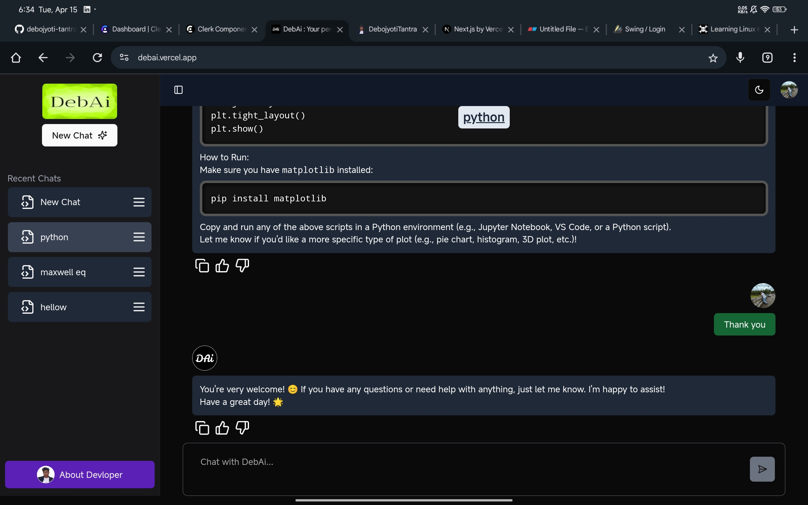

# DebAi - The AI Chat Bot

**DebAi** is a powerful AI chatbot web application built using the modern **Next.js 15** framework. It integrates **Clerk** for authentication, **MongoDB** for persistent chat storage, and **DeepSeek (OpenAI compatible)** for conversational AI completions. DebAi is fast, responsive, and fully theme-adaptable with a beautiful Tailwind CSS-based UI.

## Features

- **AI Chat Assistant** using DeepSeek (OpenAI-compatible API)
- **User Authentication** via Clerk
- **Real-Time Chat UI** with Avatar, Markdown, Syntax Highlighting
- **Dark & Light Theme** using `next-themes`
- **Persistent Chats** using MongoDB + Mongoose
- **React Markdown** rendering with Prism.js syntax highlighting
- **Mobile-Friendly & Responsive UI**

## Tech Stack

- **Frontend**: Next.js 15, React 19, Tailwind CSS, Radix UI, Lucide Icons
- **Backend**: Node.js (API Routes), MongoDB, Mongoose
- **Authentication**: Clerk
- **AI**: DeepSeek API (OpenAI-compatible)
- **Utilities**: Prism.js, React Markdown, Sonner (toast), Class Variance Authority

## Getting Started

### 1. Clone the Repository

```bash
git clone https://github.com/debojyoti-tantra/DebAi-The-AI-Chat-Bot.git
cd DebAi-The-AI-Chat-Bot
```

### 2. Install Depedencies

```
pnpm install
```

### 3. Create .env.local

```
CLERK_SECRET_KEY=your_clerk_secret_key
CLERK_PUBLISHABLE_KEY=your_clerk_publishable_key
MONGODB_URI=your_mongodb_connection_string
DEEPSEEK_API_KEY=your_deepseek_api_key
```

### 4. Run the app

```
pnpm dev
```

### The app will be running at `http://localhost:3000`

## Screenshort


